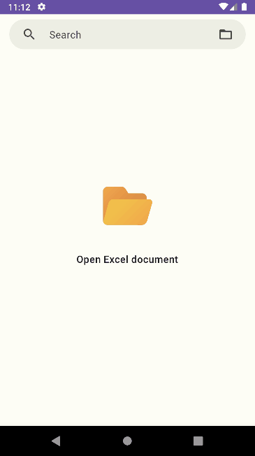
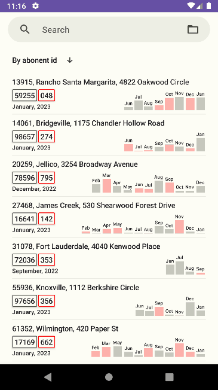
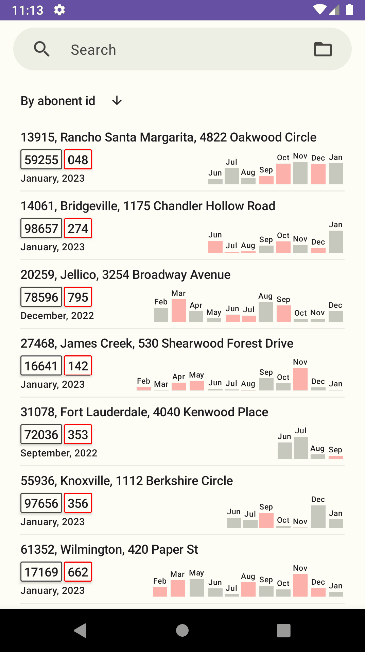
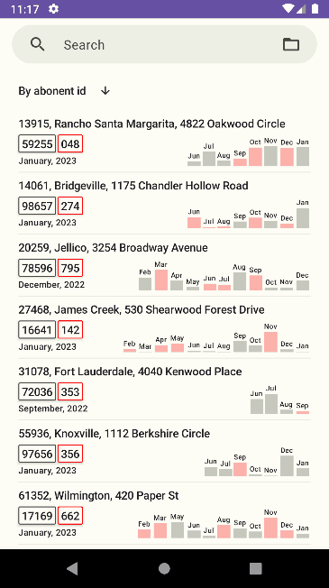

# GasMetering
Android приложение для занесения показаний счëтчиков газа.

## Описание задачи
Страница заказа на [freelance](https://www.fl.ru/projects/5064452/prilojenie-dlya-android.html).

Имеется список абонентов в формате Exсel. Укаждого абонента есть свой лицевой номер, адрес и тд., а также показания за прошлый месяц и пустая графа в которую нужно вводить текущие показания. 

Что должна делать программа:

1. Импортировать exсel список и выводить его на экран. 
2. У каждого абонента в списке должна быть добавлена кнопка, с помощью которой можно сделать фото. 
3. После того как сделали фото, открывается окно, в которое можно ввести текущие показания счëтчика. 
4. После ввода показаний они сохраняются в списке и программа вычисляет разницу с предыдущими показаниями. 
5. Если разница показаний больше или равна нулю, фото сохраняется в одноимëнную папку, если разница меньше нуля, то соответсвенно в папку с названием "меньше нуля" (главное что-бы знали, что за фото в каких папках). 
6. Фото именуется в соответствии с лицевым номером абонента, кнопку которого мы нажимали в начале. 
7. Экспортировать этот список, со всеми показаниями обратно в формате exсel. 

## Загрузка Excel документа

## Скрывающаяся панель поиска

## Поиск

## Сортировка

